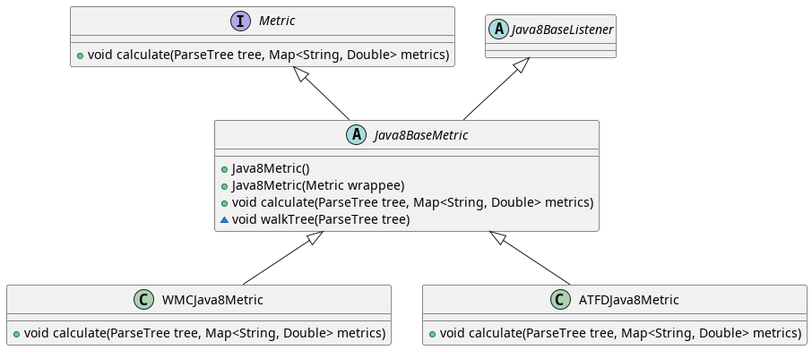
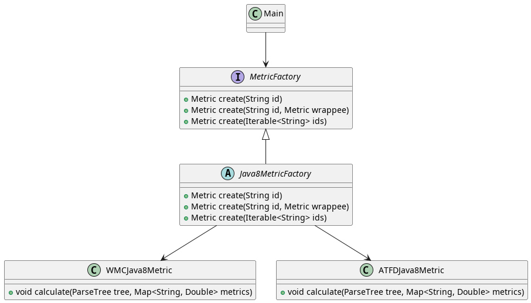
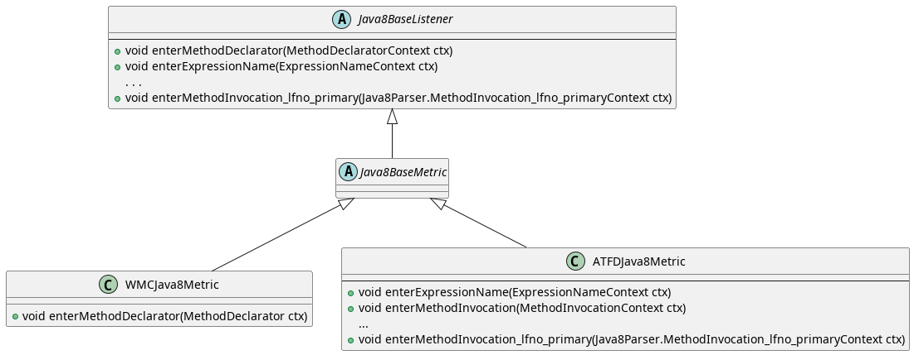
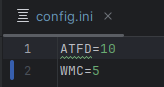
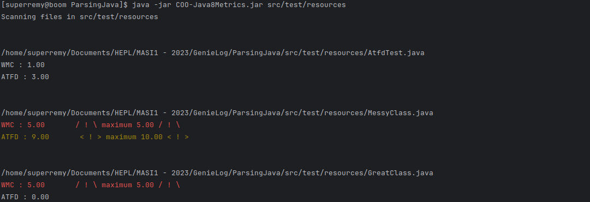
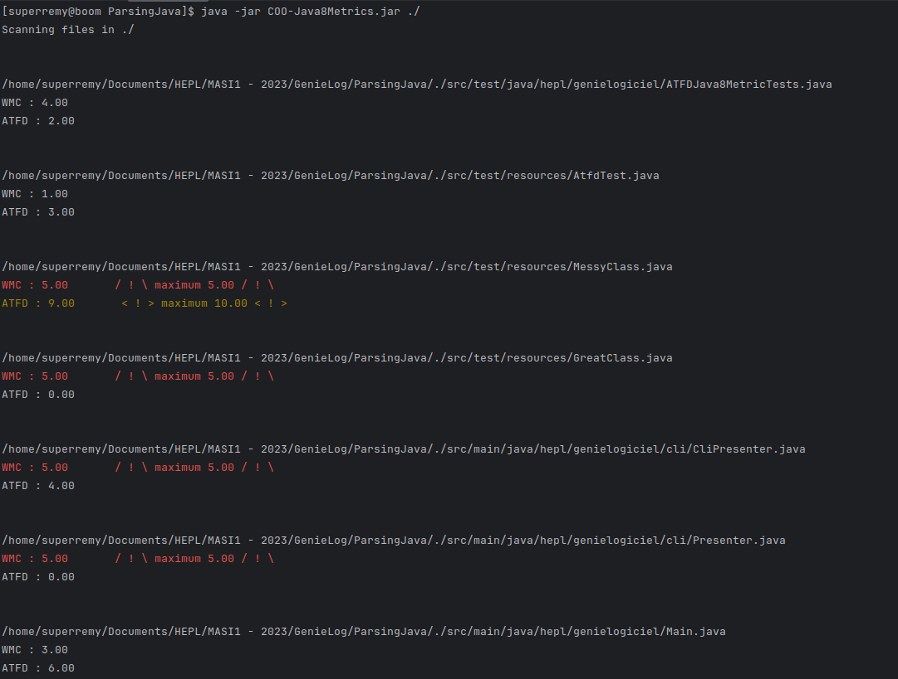

# Génie logiciel - Janvier 2024

Par Rémy Hendricé

## Code de l'application

Lien vers le code source : [GitHub](https://github.com/Hendremy/COO-Java8Metrics.git)

## Patrons de conceptions utilisés

### Décorateur

J'ai appliqué le patron "Décorateur" pour pouvoir faciliter le développement de métriques au sein du projet.



Une classe abstraite de base définit la structure d'une classe "Metric". Celle-ci hérite du Java8BaseListener généré par ANTLR pour que les classes concrètes puissent utiliser les méthodes de visite dont elles ont besoin.

Les métriques concrètes sont chacune définies dans une classe et peuvent être ensuite imbriquées pour facilement être combinées tel que dans l'extrait de code suivant :

```Java
Metric myMetrics = new WMCJava8Metric(new ATFDJava8Metric());
myMetrics.calculate(classTree, values);
```

La séparation des métriques en classes distinctes permet de travailler sur chacune d'elle de façon indépendante des autres. L'imbrication facilite l'ajout ou la suppression de métriques à évaluer.

### Factory

J'ai utilisé le patron "Factory" pour construire des objets métriques facilement à partir du simple identifiant de la métrique.



Après avoir lu les métriques à évaluer dans le fichier de configuration, ma classe Main peut ainsi demander la création des objets Metric correspondant. Ceci se fait sans que la classe Main ait besoin de connaître les types concrets des Metric.

De plus, ayant implémenté le patron "Décorateur", cette factory peut se charger également de construire une chaîne de métriques simplement à partir d'une suite d'identifiants.

### Visiteur

Ce patron de conception est inné à l'utilisation d'ANTLR dans ce projet. Afin de pouvoir exploiter l'arbre généré en parsant le code d'une classe Java, mes classes de métriques redéfinissent les méthodes exposées par la classe abstraite Java8BaseListener. Cela leur permet de récolter les données nécessaires au calcul de métriques en "visitant" les termes reconnus de la grammaire Java.



## Exemples d'exécution du programme

### Premier exemple - Classes de test

Un simple fichier .ini sert de fichier de configuration et permet de définir les seuils maximum des métriques à relever.



Le programme permet de visualiser les métriques spécifiées dans le fichier ini ainsi que de soulever des avertissements lorsque les valeurs calculées s'approchent trop des seuils définis dans le fichier de configuration.

Voici un exemple utilisant les classes que j'ai définies dans les ressources de test :



Le chemin du projet à scanner est à entrer en paramètre en ligne de commande. Cela permet de scanner tout une structure de fichiers en console.

### Deuxième exemple - Ce projet

Évidemment, ce projet peut analyser son propre code comme exposé dans la capture d'écran suivante :


